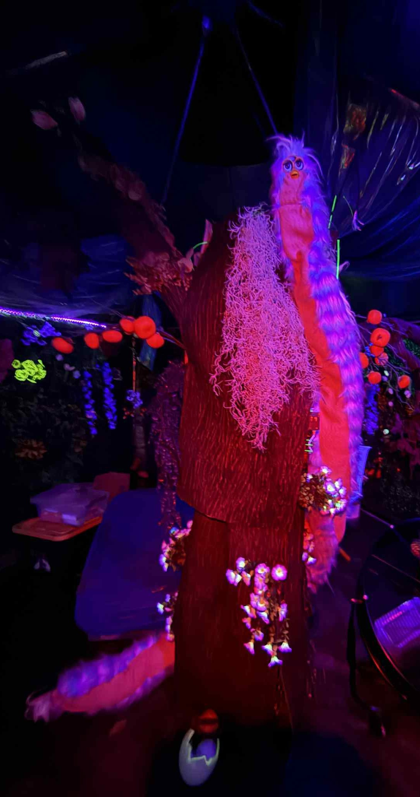

#  Cursed Furby – Jetson-powered Animatronic Art Exhibit

> _Bow before the Furby Queen_




---

Read below on how to create your own version, which involves: building the LLM stack, including **Retrieval-Augmented Generation (RAG)**, training your own voice model, and deploying everything on Jetson hardware. It is compatible with the latest *Jetson Orin Nano Super Dev Kit*.

## 1  Overview
Cursed Furby is an experimental animatronic toy that combines
* **Real-time speech recognition** (Whisper) and **LLM dialog** (llama.cpp) on an NVIDIA Jetson Orin Nano,
* **Expressive speech synthesis** (Piper) with a custom-trained Furby voice (see voice_piper_finetune),
* **Biometric sensing** (MR60BHA2 radar) and **motor control** handled by a Raspberry Pi Zero W, and
* **MQTT messaging** to glue everything together

The result is a long fluffy mildly ominous Furby Queen that listens and responds and even reacts to your heart/breathing rate, and distance.

## 2  Hardware Bill of Materials
| Qty | Part | Purpose |
|-----|------|---------|
| 1 | NVIDIA Jetson Orin Nano 8 GB | Runs Whisper, llama.cpp and Piper TTS |
| 1 | Raspberry Pi Zero W | Drives motors & reads sensors |
| 1 | MR60BHA2 mm-wave radar | Heart-rate / breath / distance sensing |
| 1 | L298N motor driver | Controls Furby motor |
| 1 | USB microphone array (ReSpeaker 4-Mic) | Audio input |
| 1 | USB speaker / DAC | Audio output |


##   Repository Layout
```
├─ furby_queen.py         # Main app on Jetson – STT/LLM/TTS + beak sync
├─ jetson_mqtt/           # Jetson-side helpers (motor_context, vitals cache, .service)
├─ pi_mqtt/               # Pi-side MQTT agent (sensor + motor)
├─ utils/                 # Misc one-off scripts
├─ config.yaml            # Central configuration (MQTT, vitals)
└─ hardware/              # Wiring diagrams & test scripts
```

##   Getting Started
###  Jetson Orin Nano
1. **Flash JetPack ≥ 5** and enable the Ubuntu 22.04 container runtime.
2. `sudo apt install git build-essential python3-venv python3-pip ffmpeg`.
3. Clone the repo:
   ```bash
   git clone https://github.com/malbu/cursed_furby.git
   cd cursed_furby
   ```
4. Create a venv and install Python deps:
   ```bash
   python3 -m venv furby_env
   source furby_env/bin/activate
   
   ```
5. **Build llama.cpp**:
   ```bash
    cd ~
   git clone https://github.com/ggerganov/llama.cpp.git
   cd llama.cpp && mkdir build && cd build

# Jetson Orin Nano is compute capability 8.7
   cmake .. -DLLAMA_CUBLAS=ON -DGGML_CUDA_ARCHS="87" \
        -DCMAKE_BUILD_TYPE=Release
   make -j$(nproc)
   ```
6. Copy your quantised *Gemma-2B-IT* GGUF model to `~/llama.cpp/models/` and the fine-tuned
   `furby_finetuned.onnx` model to `/usr/local/share/piper/models/`.
7. Test locally: `python furby_queen.py`.

### 5.2  Raspberry Pi Zero W
1. **Flash Raspberry Pi OS Lite (64-bit)** and enable SSH + Wi-Fi.
2. `sudo apt install git python3-venv python3-pip pigpio` and enable `pigpiod` at boot.
3. Clone the same repo and create a venv:
   ```bash
   git clone https://github.com/yourname/cursed_furby.git
   cd cursed_furby
   python3 -m venv furby_controls-env
   source furby_controls-env/bin/activate
   
   ```
4. **Wire** the MR60BHA2 to `/dev/ttyACM0` (USB-UART) and L298N to BCM 27/22/13.
5. Start manually with `python -m pi_mqtt`

## 6  Configuration
Edit `config.yaml` to point to your MQTT broker IP or leave the default when the Jetson is broker which was my default
```yaml
mqtt:
  broker_host: 192.168.8.234
  broker_port: 1883
vitals:
  ttl_seconds: 5
```
Both Jetson and Pi read **the same file**, so keep it in sync.

## 7  Running as a Service
### Jetson
```bash
sudo cp jetson_mqtt/the_furby.service /etc/systemd/system/
sudo systemctl daemon-reload
sudo systemctl enable --now the_furby.service
```

### Pi
```bash
sudo cp pi_mqtt/pi_mqtt.service /etc/systemd/system/
sudo systemctl daemon-reload
sudo systemctl enable --now pi_mqtt.service
```

Logs are available with `journalctl -u the_furby -f` and `journalctl -u pi_mqtt -f`.

## 8  MQTT Topics
| Topic | Direction | Payload |
|-------|-----------|---------|
| `furby/motor/cmd` | Jetson -> Pi | `start` / `stop` |
| `sensor/biometrics` | Pi -> Jetson | JSON `{heart, breath, dist_cm}` or string `[UNLOCK] …` |
| `pi/status` | Pi -> Broker | `online` / `offline` (LWT) |

## 9  Development Tips
* `USE_EMBEDDINGS` can be toggled in `furby_queen.py` to enable RAG via sentence-transformers.
* The beak motor is started **exactly** when the first audio buffer is en-queued to Piper—see `motor_context()`.
* Edit `jetson_mqtt/vitals.py` probabilities to make the Queen mention biometrics more or less often.

---

**License:** MIT © 2025 Mihai Albu. Have fun, stay cursed! 
